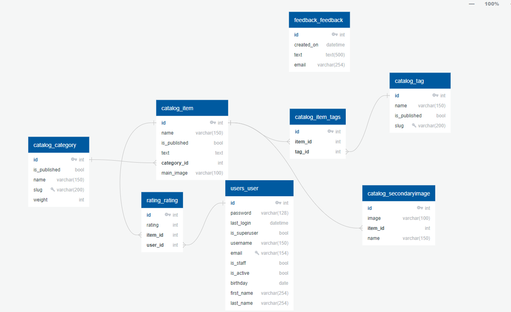

# ReSupply
### Учебный проект маркетплейса для покупки и продажи товаров со всего мира

---

Диаграмма БД: 
https://app.quickdatabasediagrams.com/#/d/cvB105

---
### Инструкция по разворачиванию (для ОС Linux):
1) Скопируйте файлы из репозитория, в корневой папке проекта
создайте файл .env для загрузки переменных окружения (пример в файле .env-example)
2) В терминале перейдите в папку проекта:
```
    cd путь/до/проекта
```
3) Настройте виртуальное окружение и активируйте его:
```    
    python3 -m venv venv
    source venv/bin/activate 
```
4) Установите необходимые библиотеки из requirements.txt:
```
    pip3 install -r requirements.txt
```
5) Перейдите в папку проекта Django:
```
    cd lyceum
```
6) Сделайте миграции для создания базы данных:
```
    python3 manage.py migrate 
```
7) Загрузите тестовые данные из фикстур:
```
    python3 manage.py loaddata catalog/fixtures/catalog_base_fixture.json
```
8) Запустите сервис:
```
    python3 manage.py runserver 0.0.0.0:80  # где 0.0.0.0:80 (опционально, если оставить пустым - поставится по умолчанию) - порт для обращений к сервису
```
9) Перейдите по предложенной ссылке

#### Создание пользователя с правами администратора:

В терминале введите команду:
```
    python3 manage.py createsuperuser
```
Затем вам предложат ввести электронную почту и пароль. После создания этот аккаунт будет иметь возможности администратора

---
### Инструкция по разворачиванию (для ОС Windows):
1) Скопируйте файлы из репозитория, в корневой папке проекта
создайте файл .env для загрузки переменных окружения (пример в файле .env-example)
2) В терминале перейдите в папку проекта:
```
    cd путь/до/проекта
```
3) Настройте виртуальное окружение и активируйте его:
```    
    python -m venv venv
    venv/Scripts/activate 
```
4) Установите необходимые библиотеки из requirements.txt:
```
    pip install -r requirements.txt
```
5) Перейдите в папку проекта Django:
```
    cd lyceum
```
6) Сделайте миграции для создания базы данных:
```
    python manage.py migrate 
```
7) Загрузите тестовые данные из фикстур:
```
    python manage.py loaddata catalog/fixtures/catalog_base_fixture.json
```
8) Запустите сервис:
```
    python manage.py runserver 0.0.0.0:80  # где 0.0.0.0:80 (опционально, если оставить пустым - поставится по умолчанию) - порт для обращений к сервису
```
9) Перейдите по предложенной ссылке

#### Создание пользователя с правами администратора:

В терминале введите команду:
```
    python manage.py createsuperuser
```
Затем вам предложат ввести электронную почту и пароль. После создания этот аккаунт будет иметь возможности администратора
